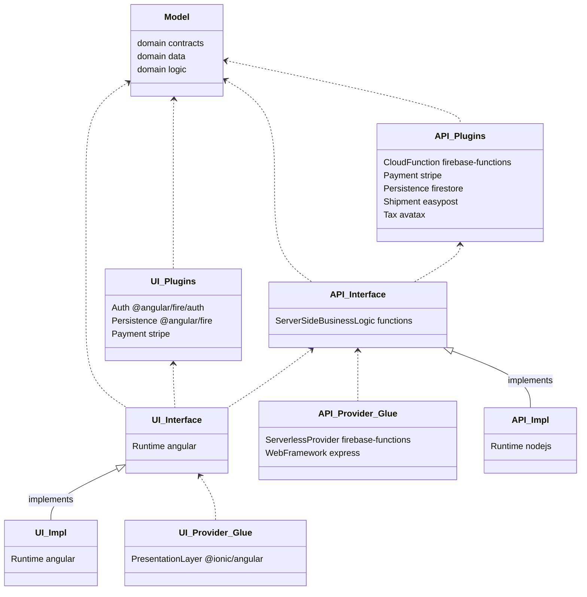

# High-level architecture

```mermaid
classDiagram
  Model <.. UI_Plugins
  Model <.. UI_Interface
	Model <.. API_Plugins
  Model <.. API_Interface

  UI_Plugins <.. UI_Interface
  API_Plugins <.. API_Interface

  API_Interface <.. API_Provider_Glue
  API_Interface <|-- API_Impl : implements
  API_Interface <.. UI_Interface

  UI_Interface <|-- UI_Impl : implements
  UI_Interface <.. UI_Provider_Glue

  class Model {
    domain contracts
    domain data
    domain logic
  }
  class API_Interface {
    ServerSideBusinessLogic functions
  }
  class UI_Interface {
    Runtime angular
  }
  class API_Plugins {
    CloudFunction firebase-functions
    Payment stripe
    Persistence firestore
    Shipment easypost
    Tax avatax
  }
  class UI_Plugins {
    Auth @angular/fire/auth
    Persistence @angular/fire
    Payment stripe
  }
  class API_Impl {
    Runtime nodejs
  }
  class UI_Impl {
    Runtime angular
  }
  class API_Provider_Glue {
    ServerlessProvider firebase-functions
    WebFramework express
  }
  class UI_Provider_Glue {
    PresentationLayer @ionic/angular
  }
```
